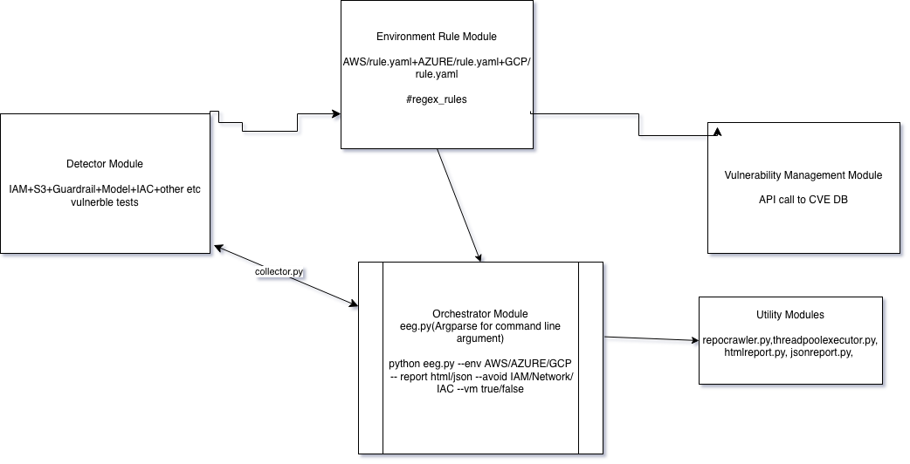

# `EEG (Extensive Exposure Guard)`<br> MultiCloud AI Security and Vulnerability Management Framework


[](https://pypi.org/project/eeg-security/)
[](https://pypi.org/project/eeg-security/)
[](https://opensource.org/licenses/MIT)

> **AI-First Cloud Security.** In a market with hundreds of cloud security tools, none focus on AI workloads. EEG is the go-to DevSecOps tool for developers to catch AI-specific vulnerabilities before pushing to production.

**Target:** AI-Specific Workload Security (No general cloud/infra drift)
**Deployment:** CI/CD Integrated Pre-deployment Testing
**Scan Modes:** Static analysis (AST + Regex) · Authenticated live audit · NVD CVE fetching

---

## Installation

```bash
pip install eeg-security
```

With cloud-specific authenticated scanning:
```bash
pip install eeg-security[aws]     # + boto3 for Bedrock/SageMaker live audit
pip install eeg-security[azure]   # + azure-identity for OpenAI/Foundry live audit
pip install eeg-security[gcp]     # + google-cloud-aiplatform for Vertex AI live audit
pip install eeg-security[all]     # All clouds
```

---

## Quick Start

```bash
# Scan a Bedrock app for AI vulnerabilities
eeg --env aws --path ./my-bedrock-app --report html

# Scan with authenticated live audit (reads ~/.aws/credentials)
eeg --env aws --auth true --path ./my-app --report json

# Scan Azure AI Foundry app, skip IAC/network checks, parallel mode
eeg --env azure --path ./foundry-app --avoid iac,network --thread max --report html

# Scan without CVE fetching (offline/air-gapped)
eeg --env gcp --path ./vertex-app --vm false --report json
```

---

## Usage

```
eeg --env aws/azure/gcp --path /path/to/repo [OPTIONS]
```

| Flag | Values | Default | Description |
|------|--------|---------|-------------|
| `--env` | `aws` `azure` `gcp` | *required* | Target cloud environment |
| `--path` | `/path/to/repo` | *required* | Repository or project directory to scan |
| `--auth` | `true` `false` | `false` | Enable authenticated live audit (reads cloud credentials) |
| `--vm` | `true` `false` | `true` | Enable NVD CVE fetching for AI dependencies |
| `--avoid` | `iam,storage,guardrail,model,network,iac,policy,prompt,secrets,logging` | *none* | Comma-separated categories to skip |
| `--thread` | `med` `max` | *sequential* | Parallel scanning: `med`(4 threads), `max`(8 threads) |
| `--report` | `json` `html` | `json` | Report output format |
| `--output-file` | `/path/to/file` | auto-generated | Custom output path (default: `eeg-report-{env}-{app}-{timestamp}.{ext}`) |

---

## What It Scans

### **I. Cloud AI Service Coverage**
* **AWS:** Bedrock (Agents, Guardrails), SageMaker (ML/LLM Endpoints, Notebooks, Pipelines), and Amazon Q.
* **Azure:** Azure OpenAI Service, AI Foundry, Azure Machine Learning, Azure AI Studio, and Prompt Flow.
* **GCP:** Vertex AI, Vertex AI Agent Builder, Vertex AI Search, Model Garden, and Generative AI Studio.
* **General:** All AI model hosting, fine-tuning, embedding services, agent frameworks, and RAG pipelines.

### **II. AI Logic & Injection Security**
* **Prompt Exploits:** System prompt leakage, prompt injection via external data sources (indirect prompt injection), and jailbreak resistance weaknesses.
* **Multimodal Security:** Multimodal prompt injection via image, audio, or document inputs into LLM pipelines.
* **Guardrail Validation:** PII filtering bypass, toxicity/content moderation bypass, insecure AI guardrail configurations, missing guardrails (CRITICAL), weak filter strengths, ANONYMIZE vs BLOCK, DRAFT vs PRODUCTION versions.
* **Agent Integrity:** AI agent tool/function calling permission abuse (excessive agency), unsafe agent memory exposure, missing human confirmation for mutating actions, and sensitive prompt/response logging.

### **III. Infrastructure & Data Security (AI-Specific)**
* **Vector Database Security:** Public access, weak auth, and unencrypted embeddings for vector stores (e.g., ChromaDB, Pinecone, Weaviate).
* **RAG Pipeline Security:** Data source leakage, context poisoning via unvalidated RAG retrieval, indirect prompt injection through poisoned documents, and write-access to knowledge base data sources.
* **Endpoint Exposure:** Insecure model endpoint exposure, over-permissive inference APIs, and "Shadow AI" endpoints.
* **AI Sandboxing:** Tool execution isolation, plugin/runtime isolation, network egress restrictions for agents, file system access control, and model execution environment isolation.
* **Model Security:** Checks for **Model Weight Exfiltration** (unprotected S3/Blob/GCS containing `.bin` or `.safetensors` files) and **Insecure Orchestration** (unauthenticated dashboards for Ray, Kubeflow, or Triton Inference Server).

### **IV. Targeted AI Stack Dependency & CVE Tracking**
Strictly monitors AI-related components and frameworks in CI/CD via NVD API:
* **Live API Monitoring:**
  * `https://services.nvd.nist.gov/rest/json/cves/2.0?keywordSearch=chromadb`
  * `https://services.nvd.nist.gov/rest/json/cves/2.0?cvssV3Severity=CRITICAL`
* **Frameworks:** LangChain, LlamaIndex, Transformers, PyTorch, FastAPI, vLLM, Ray, MLflow, and 70+ AI packages.
* **Runtime/Hardware:** CUDA, NCCL, TensorRT, and related GPU/NPU runtime libraries.
* **Full CVE Details:** Shows complete vulnerability descriptions, affected version ranges, and actionable remediation — not just links.

### **V. IAM & Misconfiguration Auditing**
* **AI IAM Scoping:** Insecure IAM permissions specifically related to AI services (e.g., overly broad `bedrock:*`, `roles/aiplatform.admin`, `Cognitive Services Contributor`).
* **S3/Blob/GCS Bucket Policies:** Detects `GetObject/*`, `PutObject/*` with broad principals on AI data buckets.
* **Misconfiguration Scanning:** Detecting sensitive exposures, unusual permissions, and insecure configurations of managed AI guardrails.
* **Data Integrity:** **Training Data Poisoning** checks — ensuring write access to datasets used for fine-tuning or RAG ingestion is strictly restricted.

### **VI. Logging & Monitoring**
* **Model Invocation Logging:** Detects missing Bedrock model invocation logging, Azure OpenAI diagnostic settings, Vertex AI audit logs.
* **Evaluation & Red-Teaming:** Flags absent model evaluation configurations and red-team testing setups.
* **CloudWatch/Log Analytics/Cloud Logging:** Validates centralized logging for AI workloads with encryption and retention policies.

### **VII. Excessive Agency (OWASP LLM06)**
* Agent action groups without human confirmation
* Unrestricted tool/function calling (`tool_choice=auto`)
* AI-generated code passed to `exec()`/`eval()`/`subprocess`
* Agent roles with `AdministratorAccess`, `Contributor`, or `roles/editor`

---

## Scan Modes

### Static Analysis (default)
Scans repository source code using **AST parsing** (Python) and **regex pattern matching** across `.py`, `.tf`, `.json`, `.yaml`, `.bicep`, `.env`, and more. 139 detection rules across 10 categories.

### Authenticated Live Audit (`--auth true`)
Connects to your cloud account and audits **live resources** — modeled after the Bedrock insecure configuration pattern
* **AWS:** Lists guardrails, agents, knowledge bases, model invocation logging, IAM policies via boto3
* **Azure:** Audits Cognitive Services accounts, deployments, content filters, network ACLs, local auth
* **GCP:** Audits Vertex AI endpoints, models, CMEK encryption, private networking

### CVE Fetching (`--vm true`, default)
Parses `requirements.txt`, `pyproject.toml`, `setup.py`, `Pipfile`, and `package.json` for AI dependencies, then queries NVD for known vulnerabilities with full descriptions and remediation steps.

---

## Reports

Reports are auto-named: `eeg-report-{env}-{appname}-{HH-MM-SS-DDMMYYYY}.{ext}`

### JSON (CI/CD)
```json
{
  "summary": {
    "total_findings": 42,
    "by_severity": {"CRITICAL": 5, "HIGH": 18, "MEDIUM": 19}
  },
  "findings": [
    {
      "rule_id": "AWS-GUARD-001",
      "severity": "CRITICAL",
      "message": "Guardrail with LOW filter strength",
      "file_path": "stacks/guardrails_stack.py",
      "line_number": 45,
      "code_snippet": "inputStrength='LOW'",
      "recommendation": "Set guardrail filter strengths to HIGH..."
    }
  ]
}
```

### HTML
Self-contained dark-themed report with severity badges, code snippets, and recommendations. Open directly in a browser.

---

## CI/CD Integration

### Exit Codes
| Code | Meaning |
|------|---------|
| `0` | No HIGH or CRITICAL findings |
| `1` | HIGH findings detected |
| `2` | CRITICAL findings detected |
| `3` | Execution error |

### GitHub Actions
```yaml
- name: EEG AI Security Scan
  run: |
    pip install eeg-security[aws]
    eeg --env aws --path . --report json --output-file eeg-report.json
    if [ $? -eq 2 ]; then
      echo "::error::CRITICAL AI security findings detected"
      exit 1
    fi
```

---

## Architecture


---

## Project Structure
```
eeg/
├── cli.py                  # CLI entry point (argparse)
├── collector.py            # Finding aggregation & deduplication
├── detectors/              # 10 static analysis detectors
│   ├── base.py             # AST + regex scanning engine
│   ├── iam.py, storage.py, guardrail.py, model.py
│   ├── network.py, iac.py, policy.py, prompt.py
│   ├── secrets.py, logging_monitor.py
├── auth_scanner/           # Authenticated live audit
│   ├── aws_scanner.py      # Bedrock guardrails, agents, KBs, logging, IAM
│   ├── azure_scanner.py    # Cognitive Services, deployments, content filters
│   └── gcp_scanner.py      # Vertex AI endpoints, models, CMEK
├── vuln_manager/           # CVE tracking
│   ├── cve_fetcher.py      # NVD API client with full descriptions
│   └── dependency_parser.py # 70+ AI package registry
├── utils/                  # Crawler, threading, reports, auth
│   ├── repocrawler.py, threadpoolexecutor.py
│   ├── htmlreport.py, jsonreport.py, auth.py
└── rules/                  # 139 YAML detection rules
    ├── aws/rule.yaml       # 50 rules (Bedrock, SageMaker)
    ├── azure/rule.yaml     # 43 rules (OpenAI, Foundry, AI Search)
    └── gcp/rule.yaml       # 46 rules (Vertex AI, Gemini)
```

---

## Contributing
Pull requests welcome. For major changes, open an issue first.

## License
[MIT](LICENSE)
